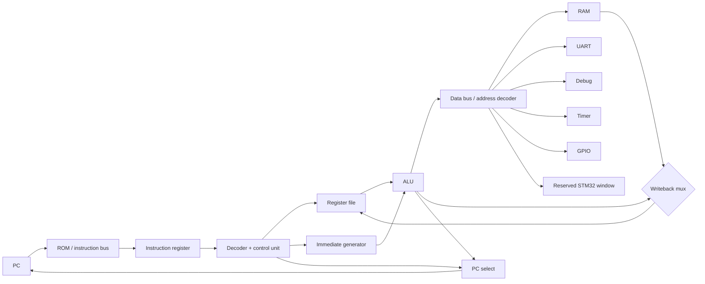
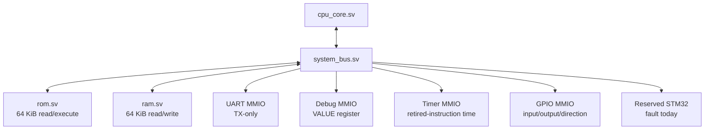

# Architecture Specification (v0.1)

## Purpose and boundary

Mini Computer models a complete small computer, not a Raspberry Pi application. The host loads ROM images, presents UART/debug output, and later bridges MMIO to an STM32. The guest CPU, bus, RAM, ROM, and peripherals are separate components with contracts suitable for RTL translation.

The repository maintains two implementations of this architecture: the C++ simulator is the golden reference for semantics, faults, and system behavior; the vendor-independent SystemVerilog RTL is the synthesizable hardware implementation. They are verified against the same architectural contracts rather than sharing source code. CMake remains the C++ reference-model build system, while `rtl/` has its own simulation workflow.

The initial CPU is multi-cycle. `tick()` advances exactly one control state; `step()` repeatedly ticks until one instruction retires, halts, or faults. This is more FPGA-realistic than treating arbitrary memory as combinational, because FPGA block RAM normally has registered/synchronous reads.

## Major modules

| Simulator module | Hardware analogue | Responsibility |
| --- | --- | --- |
| `cpu_core` | CPU datapath + sequencer | Owns PC, instruction register, microstate, and retirement/fault state. |
| `register_file` | 32 x 32 register file | Two asynchronous conceptual reads; one controlled write; `r0` constant zero. |
| `decoder` | Combinational decoder | Converts instruction bits into a decoded instruction and control signals. |
| `alu` | Combinational ALU | Performs arithmetic, logical, comparison, and shift operations. |
| `bus` | Interconnect/address decoder | Routes aligned reads/writes to ROM, RAM, UART, Timer, GPIO, or Debug. |
| `ram`, `rom` | Memory blocks | Store guest bytes and enforce their respective permissions. |
| `uart`, `timer`, `gpio`, `debug`, `stm32` | Peripheral RTL blocks | Implement register-level MMIO behavior. |

No component may index another component's backing storage directly. All guest-visible data accesses use the bus.

## Datapath

## Implemented RTL computer hierarchy

`mini32_system.sv` instantiates this hierarchy without moving datapath logic into the top level. The bus permits one outstanding request: it captures CPU request fields, issues the synchronous ROM/RAM access, and raises `ready` for one response cycle. The full 32-bit address is checked for alignment before the 14-bit memory word index is selected, preventing low-bit truncation from aliasing malformed accesses. ROM occupies `0x00000000–0x0000FFFF`; RAM occupies `0x10000000–0x1000FFFF`.

ROM and RAM use 16,384 32-bit words. Their synchronous access style is suitable for portable FPGA memory inference. ROM can use `$readmemh` initialization through its `INIT_FILE` parameter; RAM has no reset-clear loop and has unspecified power-up contents, so software writes RAM before reading it. v0.1 uses only aligned words, preserving little-endian Mini32 behavior at the word interface.

## Control and microstates

The control unit derives the following explicit signals from the decoded opcode and current microstate:

| Signal | Meaning |
| --- | --- |
| `reg_write` | Commit writeback value to `rd`; writes to `r0` are ignored. |
| `wb_select` | Select ALU result, memory read data, or `PC + 4` (for `JAL`). |
| `alu_op` | Select add, subtract, bitwise operation, compare, or shift. |
| `alu_src_imm` | Select register operand two or generated immediate. |
| `imm_kind` | Select signed 16-bit, zero-extended 16-bit, branch offset, or jump offset. |
| `mem_read` / `mem_write` | Initiate a bus transaction in the `MEMORY` state. |
| `pc_select` | Select sequential `PC + 4`, branch target, jump target, or register target. |
| `branch_predicate` | Select equality, inequality, signed-less-than, or signed-greater/equal test. |
| `halt` | Enter the terminal halted state after `HALT`. |

An ALU instruction passes through `FETCH → DECODE → EXECUTE → WRITEBACK`. A load adds `MEMORY` before writeback; a store finishes after `MEMORY`; a branch/jump updates PC in `EXECUTE`. In the RTL, `FETCH` and `MEMORY` are control phases that may persist for multiple clock cycles while a request/response bus holds `ready` low; no new request or retirement occurs during that stall.

## Reset, faults, and conventions

On reset, `PC = 0x00000000`, registers read as zero, and the CPU is not halted. `r0` is hardware-defined zero. `r30` is the software stack-pointer convention and `r31` is the return-address convention; only `JAL` has special architectural behavior, writing `PC + 4` to `r31`.

Misaligned instruction, word memory, or MMIO accesses produce a deterministic bus fault and stop execution. There are no arithmetic overflow traps or flags: integer arithmetic wraps modulo 2^32.

## Deterministic Timer

Timer time is architectural, not physical: one tick occurs after each successful instruction retirement when CONTROL.ENABLE is set. Thus a successful control-register write that enables the Timer contributes its first tick, while a faulting instruction contributes none; HALT contributes one. This post-retirement ordering makes the C++ golden model and RTL equivalent despite their different internal cycle counts. A future platform may add a separate physical-clock timer.

## FPGA migration

The C++ classes should have no hidden host behavior in their architectural interfaces. For example, a UART may use a host callback only at its output boundary; its readable/writable registers and status bits remain exactly specified. An RTL version can replace that callback with a physical UART transmitter without altering guest software or the bus protocol.
